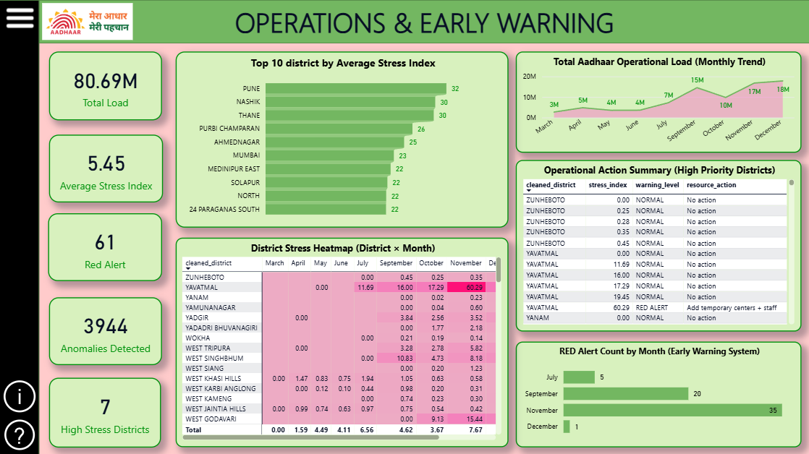
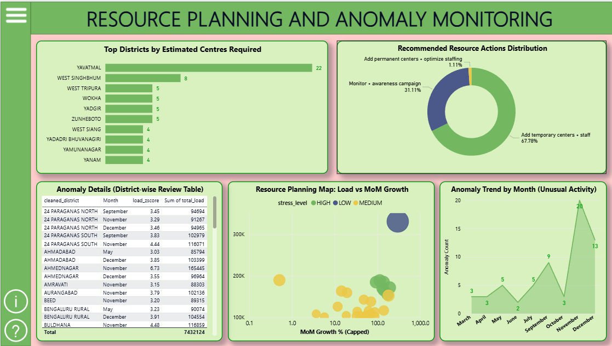

# UIDAI Operational Intelligence System

District-level operational intelligence and early warning system for Aadhaar workload monitoring using Python and Power BI.

## Project Overview

This project was developed for the UIDAI Hackathon 2026 to address operational overload in Aadhaar enrolment and update services.

The system transforms raw UIDAI operational datasets into actionable insights using data engineering, stress analytics, anomaly detection, and interactive Power BI dashboards.

The solution enables:
- District-level workload monitoring
- Stress Index generation (0–100)
- Early Warning Alerts (RED / ORANGE / NORMAL)
- Resource planning recommendations
- Anomaly detection for unusual operational activity

---

## Problem Statement

UIDAI operational datasets show uneven workload distribution across districts and months. Certain districts experience sudden spikes in enrolment and update activity, causing:

- overloaded centres
- longer waiting times
- staffing imbalance
- delayed service operations

This project introduces a proactive operational monitoring framework for identifying overload hotspots and supporting better resource planning.

---

## Tech Stack

- Python
- Pandas
- NumPy
- Scikit-learn
- Google Colab
- Power BI

---

## Key Features

### Data Engineering
- Multi-file dataset merging
- Geo standardization
- District normalization
- Pincode validation
- Cleaned vs rejected record separation

### Analytics
- Stress Index computation
- Month-over-Month growth analysis
- Moving average baseline analysis
- Early warning alert generation
- Z-score anomaly detection

### Dashboarding
Interactive Power BI Operational Command Center with:
- overload monitoring
- district stress heatmaps
- alert tracking
- resource planning insights
- anomaly monitoring

---

## Dashboard Preview

### Operations & Early Warning Dashboard



### Resource Planning & Anomaly Monitoring



---

## Project Structure

```bash
uidai-operational-intelligence/
│
├── notebooks/
├── dashboards/
├── reports/
├── screenshots/
├── data/
├── README.md
└── requirements.txt
```

---

## Repository Contents

| Folder | Description |
|---|---|
| notebooks | Google Colab / Jupyter Notebook |
| dashboards | Power BI dashboard file |
| reports | Final hackathon report |
| screenshots | Dashboard previews |
| data | Sample or processed datasets |

---

## Future Scope

- Real-time overload monitoring
- Predictive ML forecasting
- Automated alert generation
- Integration with operational KPIs

---
